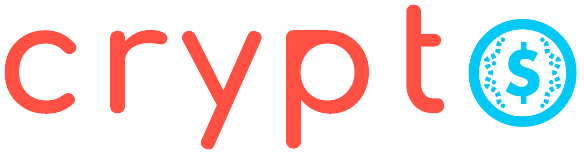

<h1 align="center">📊 Crypto</h1>

  

## 📌 Index
- [About](#about)
- [What's inside the box](#whats-inside-the-box)
- [How to play](#how-to-play)
- [To implement](#to-implement)

<h1 id="about">❓ About</h1>

This project has the functionality to list some coins in the market, in Crypto you can see the main coins at the moment and pin your favorites. You also can log (with Google or Facebook) in the application to save all your data.

<h1 id="whats-inside-the-box">📦 What's inside the box</h1>

- [React](https://reactjs.org)
- [Firebase](https://firebase.google.com/)
- [Typescript](https://www.typescriptlang.org/)
- [Axios](https://github.com/axios/axios)
- [React Icons](https://www.npmjs.com/package/react-icons)

<h1 id="how-to-play">🎮 How to play</h1>

[...] work in progress [...]
